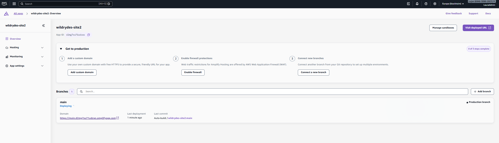
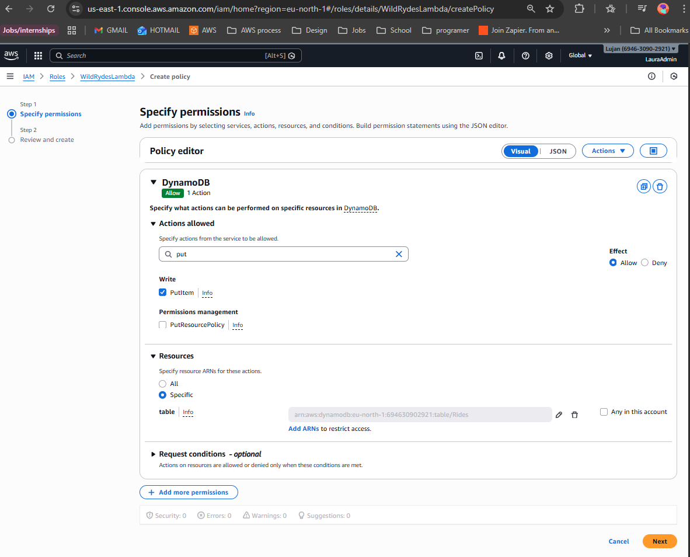
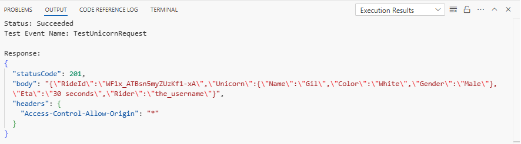
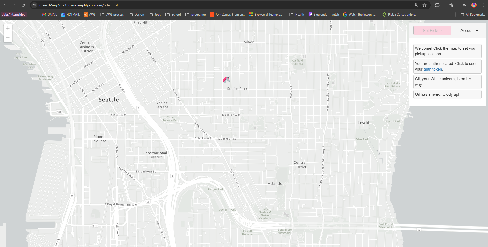
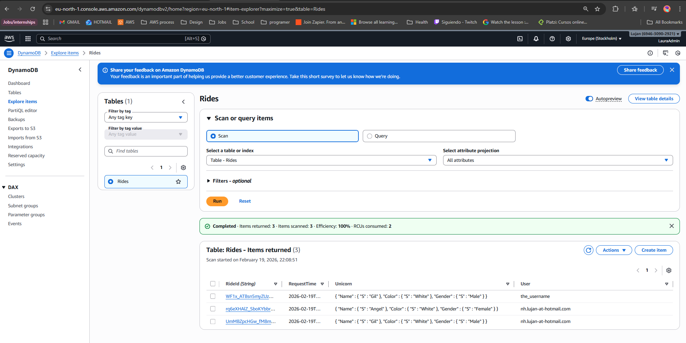

# AWS Project: Serverless Web App (Wild Rydes)

I built this project to get hands-on experience with a fully serverless architecture on AWS. I used a starter frontend from a tutorial and focused my work on building out the backend, security, and cloud infrastructure required to make it a functioning application.

## The Architecture
The app is built using a decoupled frontend/backend approach:
* **Host:** AWS Amplify (handles the CI/CD pipeline)
* **Identity:** Amazon Cognito (JWT-based auth)
* **Backend:** Node.js 20.x Lambda function
* **API:** REST API via Amazon API Gateway
* **Data:** Amazon DynamoDB

## What I worked on

### 🛠️ Setting up the Pipeline
I started by connecting my GitHub repo to **AWS Amplify**. This automated the deployments. I tested the CI/CD pipeline by making a change to the UI code in GitHub; Amplify detected the push and updated the live site automatically.

### 🔐 Auth and Security
For user management, I configured **Amazon Cognito**. It handles the sign-up flow and email verification. Once a user logs in, the app gets a session token. I then configured an **API Gateway Authorizer** to check for this token, protecting the backend from unauthorized requests.

### ⚙️ The Backend Logic & IAM
The logic is handled by a Lambda function. A major focus here was **IAM security**. Instead of giving the function broad access, I wrote a custom policy that restricts it to only writing data to the specific DynamoDB table ARN. This follows the principle of least privilege.

I verified the logic by running a test event through the Lambda console. It returned a successful **201 status**, confirming the database write was working.

## Final Result
After connecting the API Gateway to the frontend, the app was fully live. You can pick a location on the map, and the system assigns a unicorn and saves the trip data into DynamoDB.

**Verification:** I checked the DynamoDB table after the request, and the ride entries appeared with the correct timestamps and user IDs.

## Credits
The frontend assets and application blueprint are from the [Wild Rydes Serverless Workshop](https://github.com/aws-samples/aws-serverless-workshops), as featured in the [Tiny Technical Tutorials](https://github.com/tinytechnicaltutorials/wildrydes-site) guide. 

**My contribution involved the end-to-end AWS resource provisioning, IAM security policy authoring, and service integration.**
